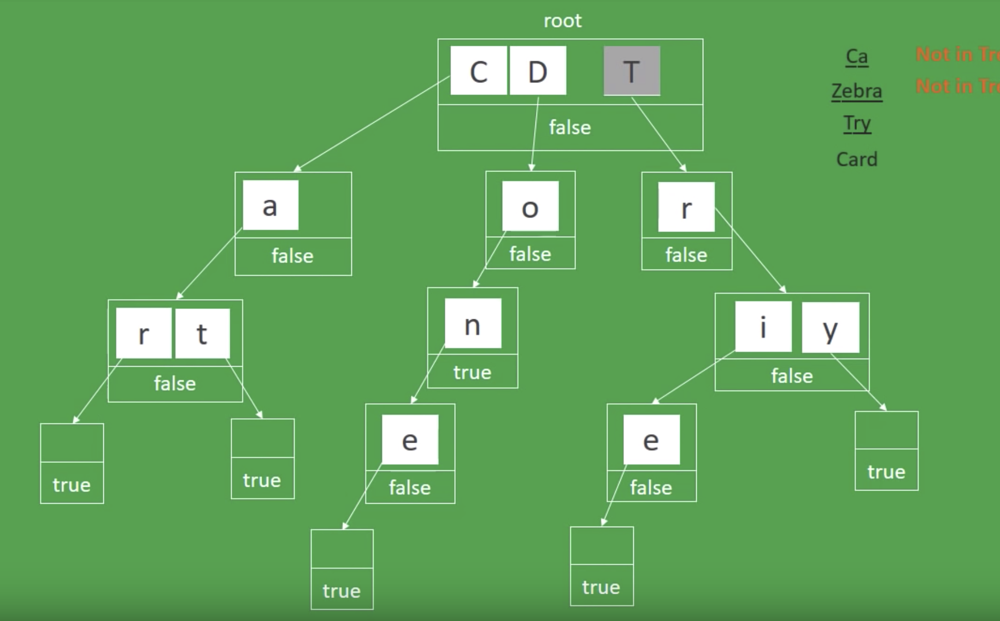

# Basics
## Swap
* a, b = b, a
## Char
* 26 letters, chr <=> ord
* '1'.isdigit()
## Iterables
* zip(\*iterable) can zip multiple iterables
* itertools.zip_longest([1, 2], [1, 2, 3])
* all, any
### List
* "".join(list(reversed("fujian")))
* list.reverse()  # in-place reverse
* list[i:j] = list[i:j][::-1]
* \[\[0 for x in range(columns)] for y in range(rows)]
* Copy a list: list(orig), ls[:]
* IF-ELSE + list expressions
```python3
[a if cond else b for i in iterable]
```
### Tuple
* Concat: (1,2) + (1,)
* Transform from list to tuple: map(tuple, ls)

### Set
* A | B (A.union(B)), A |= B (A.update(B))
* & -> intersection, intersection_update
* - -> difference, difference_update
* ^ -> symmetric_difference, symmetric_difference_update
* <= -> issubset
* \>= -> issuperset

## Math
* 5 / 2 == 2.5, 5//2 == 2
* +/- math.inf
* math.log10, math.log(base e), math.log2
## Matrix
* Transpose a matrix
```python3
M = [[1,2,3],[4,5,6],[7,8,9]]
print(list(zip(*M))) # [(1, 4, 7), (2, 5, 8), (3, 6, 9)]
```
* Matrix traverse
```python3
directions = [(0, 1), (1, 0), (0, -1), (-1, 0)] # right - down - left - up
```
## Functions
* yield, yield from
* functools.reduce(lambda a,b : a if a > b else b,list)  <=> max(list)

## OOP
1. \_\_slots\_\_ VS \_\_dict\_\_, slots is used to reduce the memory consumption, HOWEVER, since python3.3, it is not impressive

## Other
* encode info in the existing data structure: board[y][x] ^= 256 for letters

# Data structure
## Namedtuple:
* Person = collections.namedtuple('Person', 'name age gender')
## Priority Queue:
```python3
from queue import PriorityQueue

q = PriorityQueue()

q.put((2, 'code'))
q.put((1, 'eat'))
q.put((3, 'sleep'))

while not q.empty():
    next_item = q.get()
    print(next_item)

# Result:
#   (1, 'eat')
#   (2, 'code')
#   (3, 'sleep')
```
## Trie


```python3
class Node:

    def __init__(self):
        self.letters = dict()
        self.is_word = False # store other useful info here, eg: word = ""

class Trie:

    def __init__(self):
        self.root = Node()

    def insert_word(self, word):
        node = self.root
        for c in word:
            if c not in node.letters:
                node.letters[c] = Node()
            node = node.letters[c]
        node.is_word = True

    def search_word(self, word):
        node = self.root
        for c in word:
            if c not in node.letters:
                return False
            node = node.letters[c]
        return node.is_word

    def _delete(self, node, word, index):
        if node.is_word and node.letters:
            node.is_word = False
            return node
        elif node.is_word and not node.letters:
            return None
        else:
            val = self._delete(node.letters[word[index]], word, index + 1)
            if val is None:
                del node.letters[word[index]]
                if not node.letters:
                    return None
            return node

    def delete_word(self, word):
        if self.search_word(word):
            self._delete(self.root, word, 0)
```

## Union Find
### Quick Find
```python3
class UF:
    def __init__(self, N):
        self.nodes = list(range(N))
    def root(self, i):  # find
        return self.nodes[i]
    def connected(self, i, j):
        return self.root(i) == self.root(j)
    def union(self, i, j): # union too expensive, trees are flat but expensive to keep
        iid = self.nodes[i]
        jid = self.nodes[j]
        for index in range(N):
            if self.nodes[index] == jid:
                self.nodes[index] = iid
```
## Quick Union
```python3
class UF:
    ...
    def root(self, i): # find: if tree is tall, too expensive
        while self.nodes[i] != i:
            i = self.nodes[i]
        return i 
    ...  
    def union(self, i, j): # trees get tall
        iid = self.root(i)
        jid = self.root(j)
        self.nodes[iid] = jid
```
## Imp: Weighted Quick Union
```python3
class UF:
    def __init__(self, N):
        ...
        self.size = [1] * N
    def root(self, i): pass # as above
    def connected(self, i, j): pass
    def union(self, i, j): # depth of any node is at most lgN
        iid = self.root(i)
        jid = self.root(j)
        if self.size[iid] > self.size[jid]:
            self.nodes[jid] = iid
            self.size[iid] += self.size[jid]
        else:
            self.nodes[iid] = jid
            self.size[jid] += self.size[iid]
```
## Imp: Path compression
```python3
class UF:
    ...
    def root(self, i):
        while self.nodes[i] != i:
            self.nodes[i] = self.nodes[self.nodes[i]] # half the root
            i = self.nodes[i]
        return i
    ...
```
## Graph
### Adjacent Matrix
```python3
from collections import defaultdict
graph = defaultdict(list)
if connected(i, j):
    # Symmetric
    graph[i].append(j)
    graph[j].append(i)
```

## Deque

## Stack
* Two stacks technique (the other stack records more information, eg: minStack, maxStack)
### Monotone Stack
* Complexity: O(n), only stack-in and stack-out at most once
```python3
# existing sequence
stack = []
# Add index rather than the value
while i < len(sequence):
    while stack and v > sequence[stack[-1]]: # Non-increasing stack
    # while stack and v < sequence[stack[-1]]: # Non-decreasing stack
        j = stack.pop()
        process_logic(j)
    else:
        stack.append(i)
        i += 1
```


# Algorithm

# Bit Manipulation
* num &(num-1) == 0  <=> num is power of 2
* num ^= 1 <=> flip between 0 and 1
* 0, 1 -> 2, 3 | 00, 01 -> 10, 11 => use bits to encode more information

# Search
* Linear search | randomly VS sorted
* Binary Search
```python3
# Search
import bisect
bisect.bisect([1,2,3,3,4], 3) # bisect_right, return 4
bisect.bisect_left([1,2,3,3,4], 3) # return 2
```
```python3
def binary_search(nums, target):
    lo = 0
    hi = len(nums) - 1
    while lo + 1 < hi: # Stop when lo + 1 == hi
        mid = lo + (hi - lo) // 2  # Avoid overflow
        if nums[mid] > target:
            hi = mid  # Invariant: nums[hi] > target => the rightest
        else:
            lo = mid   
            
    if nums[lo] == target:
        return lo
    if nums[hi] == target:
        return hi
    return -1
```
# Two Pointer
## Same direction
start, end = 0, 0 + Hashmap | find substring that satisfies some restrictions

## Sorting
### QuickSort

### Toposort

## Breadth First Search
## Depth First Search
### Iterative - stack
```python3
seen = [False] * num_of_elements
for i in range(num_of_elements):
    if not seen[i]:
        stack = [i]
        seen[i] = True
        while stack:
            item = stack.pop()
            process(item)
            for nei in neighbors:
                if not seen[nei]:
                    seen[nei] = True
                    stack.append(nei)
```
### Recursive
```python3
def dfs(source, target):
    if source not in seen:
        seen.add(source)
        if source == target: return True
        return any(dfs(nei, target) for nei in neighbors)
```

## Backtracking
* Recursion on every possible solutions
* Use memo to prune the branches

## Dynamic Programming
* Define the transition formula
* Break it into two problems: forward traverse and backward traverse
* Top-bottom approach + memorization -> Recursive
* Bottom-top approach + result set -> Iterative


# [Complexity](https://www.freecodecamp.org/news/time-is-complex-but-priceless-f0abd015063c/)
* Draw the recursion tree

# Gotchas
* Read questions carefully
* Interview process:
    - Phone screen
    - Technology phone screen
    - Take-home assessment
    - On-site interviews
* Non-technical skills:
    - Problem solving
    - [How to ask good questions](https://jvns.ca/blog/good-questions/)
    - Understand assumptions
* [Recursion](https://youtu.be/AfBqVVKg4GE)
* [OOP](https://realpython.com/python3-object-oriented-programming/)
* [data structure](http://interactivepython.org/runestone/static/pythonds/index.html)
